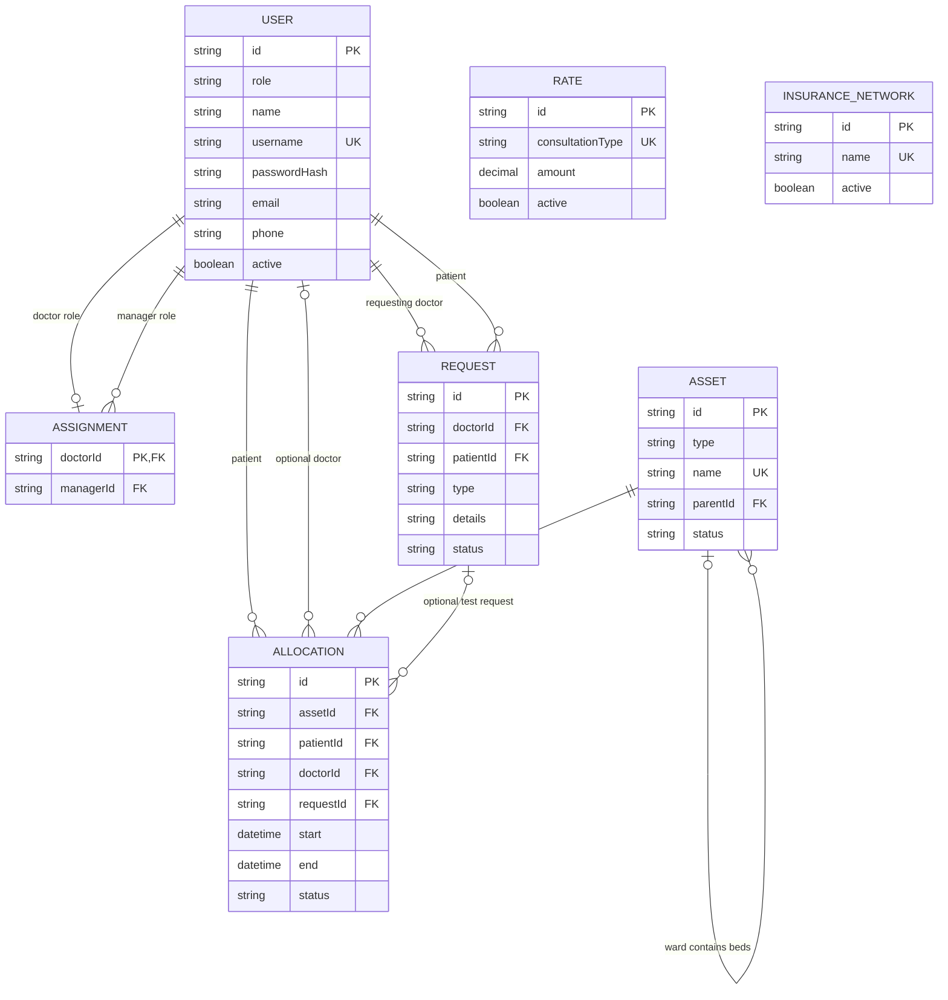
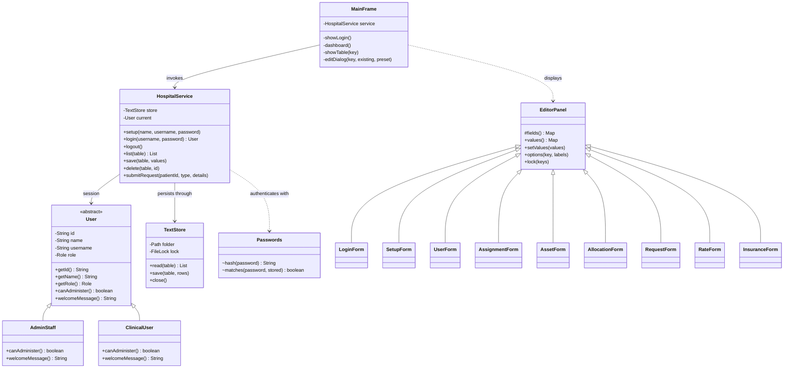
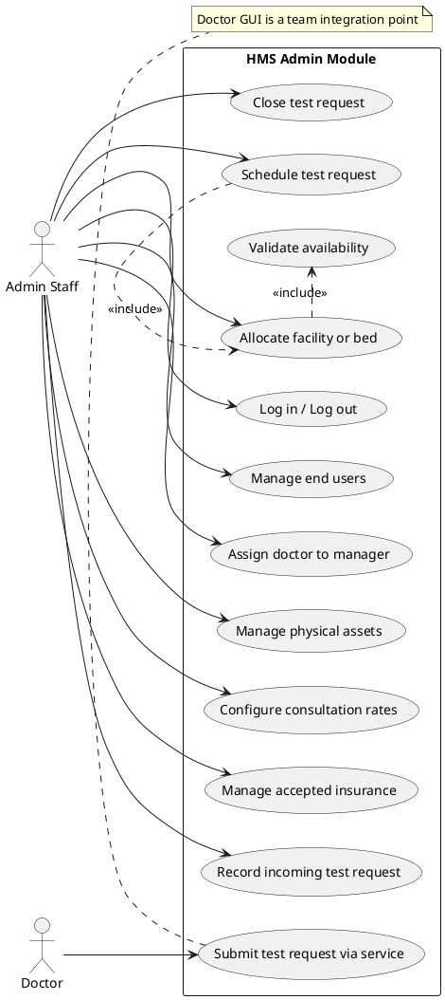
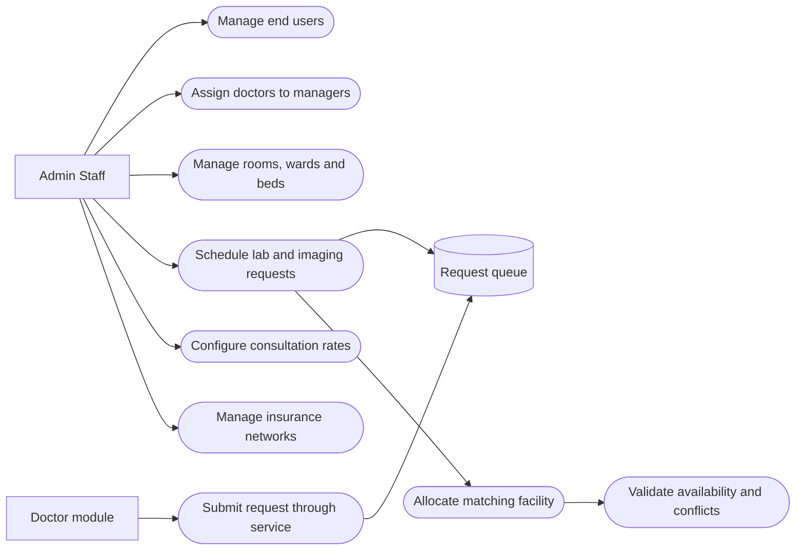
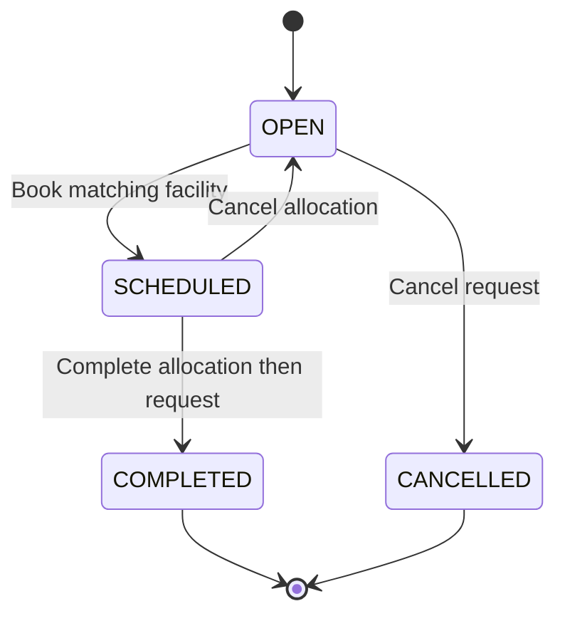

# Admin module diagrams

These diagrams describe the implemented admin module. The ERD documents text-file relationships; no database is used. A patient and doctor are role-constrained records in `USER`, not separate user tables.

## Entity relationship diagram

RATE and INSURANCE_NETWORK are independent configuration records until teammates integrate appointments/billing and patient policies. One request can have cancelled historical allocations, but only one non-cancelled allocation. A BED must have exactly one WARD parent; other asset types have no parent.

## Class diagram

`ClinicalUser` represents manager, doctor and patient identities through its role enum. Their separate domain behaviours and dashboards belong to teammates. Asset/request/rate records currently use field maps validated by `HospitalService`; the ERD entities are not all Java classes. This distinction should be preserved in the report.

## Use case diagram source

The following PlantUML source expresses actors and the admin use cases. Render it with a PlantUML tool if your report needs a UML image. The Mermaid overview below can be read directly without a renderer installation.

## Request workflow

